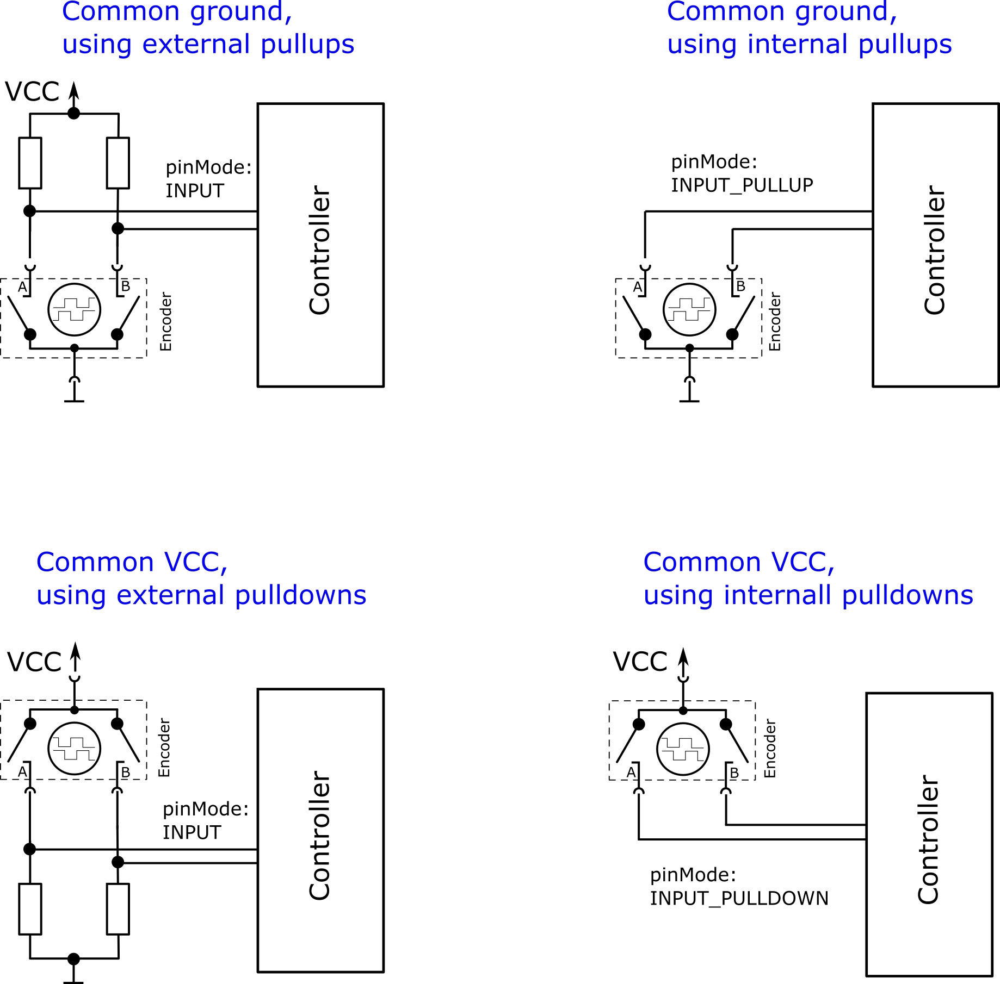

[![Banner]][Overview]

# Connecting Encoders

*Encoders can be connected as shown in the diagram below.*

 

 

## Connections

➜ Connect the two phases **A** & **B** to a digital input.

➜ Connect the encoder pin to either **GND** or **VCC**.

 

## Tolerances

Make sure your **VCC** isn't too high.

| Model | Range 
|:-----:|:-----:
| Teensy 3.2 | `3.3 - 5V`
| Teensy 3.5 | `3.3 - 5V`
| Teensy 3.6 | `3.3V`
| Teensy 4.x | `3.3V`

 

## Note

*Usually, you don't need the external pull up / down*  
*resistors and can simply use the built-in ones instead.*

<!----------------------------------------------------------------------------->

[Overview]: Overview.md
[Banner]: ../Resources/Image/Banner/Current.png
