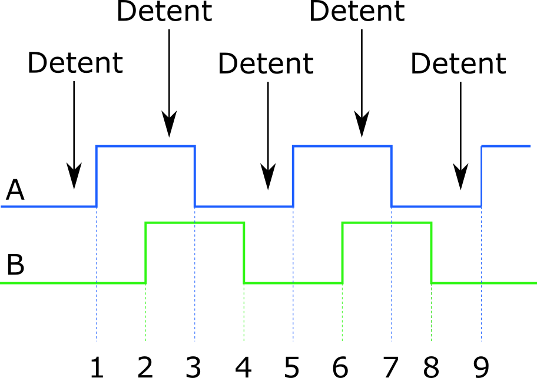

[![Banner]][Overview]

 

# Encoders With Detents

*Manually operated encoders often have mechanical detents*  
*to give tactile feedback to the user and are usually placed  
to be synchronized with one period of the quadrature signal.*

 
 

## x4 Type Encoders

Usually the detents are placed at rotational  
positions where both switches are open. 

Therefore the standard counting algorithm would  
return a change of 4 counts between detents.

Those encoders are sometimes called `x4-type`.

 

 

### Pro

At the stable detent position both switches are open  
and no current flows through the pull up resistors.

 

### Con

You can only use one quarter of the available pulses. 

 

---

 

## x2 Type Encoders

One can also find encoders which place their  
detents at every second count pulse, `x2 Type`.

The standard counting algorithm will  
give increments of 2 between detents. 

 

 

### Pro

Allows for increased resolution.

 

### Con

The detent position is always when one switch is closed.

 

---

 

## Encoder Jitter

Sometimes the detents are placed not *between*  
the quadrature edges but exactly *at* the edges.

Because of that, the detent position the  
encoder can easily generate jitter pulses.

 

 

In the following you can find a cutout of the `ALPS EC11`  
datasheet showing the different detent types available.

 

 

The encoders in the left column are  `x2 Type`  encoders  
with their detents at stable positions of phase  ` A `  &  ` B ` .

The encoders in the middle column are  `x2 Type`  encoders  
with their detents sitting on the edge of the phase  ` B ` .

The datasheet explicitly mentions that the stability for the 
` B `  signal can not be guaranteed at the detent position.

<!----------------------------------------------------------------------------->

[Overview]: Overview.md
[Banner]: ../Resources/Image/Banner/Current.png

